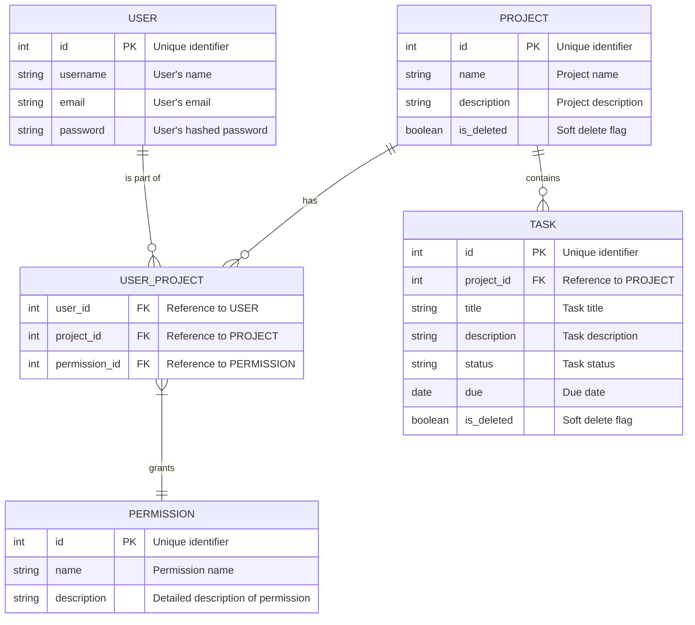

# Django-REST---Project-Management-project

```mermaid
erDiagram
    USER {
        int id PK "Unique identifier"
        string username "User's name"
        string email "User's email"
        string password "User's hashed password"
    }
    PROJECT {
        int id PK "Unique identifier"
        string name "Project name"
        string description "Project description"
        boolean is_deleted "Soft delete flag"
    }
    TASK {
        int id PK "Unique identifier"
        int project_id FK "Reference to PROJECT"
        string title "Task title"
        string description "Task description"
        string status "Task status"
        date due "Due date"
        boolean is_deleted "Soft delete flag"
    }
    PERMISSION {
        int id PK "Unique identifier"
        string name "Permission name"
        string description "Detailed description of permission"
    }
    USER_PROJECT {
        int user_id FK "Reference to USER"
        int project_id FK "Reference to PROJECT"
        int permission_id FK "Reference to PERMISSION"
    }

    USER ||--o{ USER_PROJECT : "is part of"
    PROJECT ||--o{ USER_PROJECT : "has"
    USER_PROJECT }|--|| PERMISSION : "grants"
    PROJECT ||--o{ TASK : "contains"
```